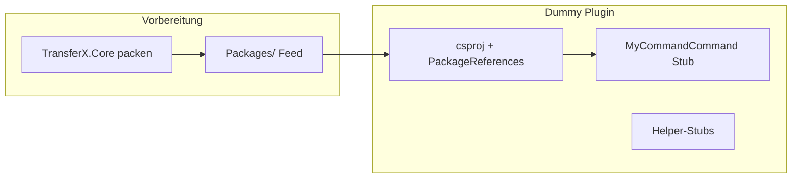

# TransferX.Transfer.Dummy – Stub-Implementierung gemäss Plugin-Leitfaden

## Ausgangslage

Das Projekt [`TransferX.Transfer.Dummy.csproj`](C:/Data/Repositories/TransferX/Source/Plugins/Transfers/Dummy/TransferX.Transfer.Dummy/TransferX.Transfer.Dummy.csproj) ist ein Scaffold mit:

- [`MyCommandCommand.cs`](C:/Data/Repositories/TransferX/Source/Plugins/Transfers/Dummy/TransferX.Transfer.Dummy/MyCommandCommand.cs) – `[TransferMetadata]`, `ITransferCommand`, **ExecuteAsync gibt sofort `Success=true` mit 0 Dateien zurück**
- Leere Helper-Stubs [`PathMapper.cs`](C:/Data/Repositories/TransferX/Source/Plugins/Transfers/Dummy/TransferX.Transfer.Dummy/Helpers/PathMapper.cs) / [`ChangeDetector.cs`](C:/Data/Repositories/TransferX/Source/Plugins/Transfers/Dummy/TransferX.Transfer.Dummy/Helpers/ChangeDetector.cs)
- Nur `TransferX.Transfer.Abstractions` 2.0.0 als NuGet-Referenz

Der Leitfaden [`TransferXImplementTransferPlugin.md`](C:/Data/Repositories/TransferX/Source/TransferX/docs/TransferXImplementTransferPlugin.md) beschreibt ein vollständiges Copy-Beispiel (`MyCopyCommand`); laut Ihrer Auswahl bleibt **ExecuteAsync ein Minimal-Stub**, die **Struktur und Metadaten** sollen aber den Checklisten-Punkten entsprechen.



---

## Phase 1: TransferX.Core als NuGet packbar machen

**Problem:** [`TransferX.Core.csproj`](C:/Data/Repositories/TransferX/Source/TransferX/src/TransferX.Core/TransferX.Core.csproj) hat aktuell **keine** NuGet-Metadaten (`PackageId`, `IsPackable`), im Gegensatz zu Domain/Abstractions. Der lokale Feed [`Packages/`](C:/Data/Repositories/TransferX/Packages) ist leer; `TransferX.*`-Pakete werden laut [`NuGet.Config`](C:/Data/Repositories/TransferX/NuGet.Config) ausschliesslich von dort bezogen.

**Änderung an `TransferX.Core.csproj`** – analog zu [`TransferX.Transfer.Abstractions.csproj`](C:/Data/Repositories/TransferX/Source/TransferX/src/TransferX.Transfer.Abstractions/TransferX.Transfer.Abstractions.csproj):

```xml
<PropertyGroup>
  <PackageId>TransferX.Core</PackageId>
  <Version>2.0.0</Version>
  <Description>Core services for TransferX plugins (ProgressAggregator, engines, loaders)</Description>
  <IsPackable>true</IsPackable>
  <PackageOutputPath>..\..\..\..\Packages</PackageOutputPath>
</PropertyGroup>
```

- Version **2.0.0** fest pinnen (wie Abstractions-Pakete und Doku), nicht die dynamische `Directory.Build.props`-Version
- `GenerateDocumentationFile` ist bereits repo-weit aktiv

**Hinweis zur Abhängigkeit:** Core referenziert intern [`TransferX.Application`](C:/Data/Repositories/TransferX/Source/TransferX/src/TransferX.Application/TransferX.Application.csproj) (Engines/DI). Beim Packen muss geprüft werden, ob das `.nupkg` korrekt auflösbar ist. Falls `dotnet pack` Application-Assemblies mit einbindet oder Restore-Probleme entstehen, wird das im Build-Schritt dokumentiert und ggf. mit `<PrivateAssets>` / expliziten Paket-Abhängigkeiten nachjustiert.

**Pack-Befehl** (Repo-Root `C:/Data/Repositories/TransferX`):

```powershell
dotnet pack Source/TransferX/src/TransferX.Core/TransferX.Core.csproj -c Release
```

Erwartetes Ergebnis: `Packages/TransferX.Core.2.0.0.nupkg`

Optional: Doku [`TransferXNuGetPackages.md`](C:/Data/Repositories/TransferX/Source/TransferX/docs/TransferXNuGetPackages.md) um Core ergänzen (nur wenn gewünscht – nicht zwingend für die Implementierung).

---

## Phase 2: Dummy-Projekt gemäss Leitfaden vervollständigen

### 2.1 `.csproj` – Abhängigkeiten

[`TransferX.Transfer.Dummy.csproj`](C:/Data/Repositories/TransferX/Source/Plugins/Transfers/Dummy/TransferX.Transfer.Dummy/TransferX.Transfer.Dummy.csproj) erweitern:

```xml
<PackageReference Include="TransferX.Transfer.Abstractions" Version="2.0.0" />
<PackageReference Include="TransferX.Core" Version="2.0.0" />
```

Damit ist das Plugin für exportiert für spätere Nutzung von `ProgressAggregator` (siehe [`TransferXCore.md`](C:/Data/Repositories/TransferX/Source/TransferX/docs/TransferXCore.md#services-progressaggregator)), auch wenn der Stub ihn noch nicht aufruft.

### 2.2 `MyCommandCommand.cs` – Struktureller Stub

Bestehende Klasse beibehalten (`CommandName = "MyCommand"`), folgende Punkte aus Checkliste Abschnitt 8 umsetzen:

| Checklisten-Punkt | Umsetzung im Stub |
|---|---|
| `[TransferMetadata]` | Bereits vorhanden |
| `CommandName`, `Description`, `Version` | Description präzisieren (deutsch, ohne TODO); Encoding-Fehler in XML-Kommentaren korrigieren (`ergänzen` → `ergänzen`) |
| `ExecuteAsync`-Struktur | `CancellationToken.ThrowIfCancellationRequested()`, try/catch/finally-Muster wie in Doku Abschnitt 4.5 |
| `TransferResult` | Korrekt befüllt: `Success=true`, alle Zähler `0`, leere `FileResults`, `Duration` gesetzt |
| Einzeldatei-Fehler / Progress | **Nicht implementiert** (bewusster Stub) – stattdessen kurzer `/// <remarks>`-Kommentar mit Verweis auf Doku-Abschnitt 7 für spätere Copy-Logik |
| `OperationCanceledException` | Weiter propagieren (bereits vorhanden) |
| Globaler Fehler | `catch (Exception)` → `TransferResult` mit `Success=false`, `ErrorMessage` (bereits vorhanden) |

**Kein** List/Download/Upload, **kein** `ProgressAggregator`-Aufruf – nur vorbereitende `using`-Direktiven oder auskommentiertes Beispielsnippet aus der Doku als Platzhalter.

**API-Hinweis:** In der Doku steht teils `FailFile(filePath, string message)`; die tatsächliche Signatur in [`ProgressAggregator.cs`](C:/Data/Repositories/TransferX/Source/TransferX/src/TransferX.Core/Services/Progress/ProgressAggregator.cs) ist `FailFile(string filePath, long fileSize)`. Bei späterer Implementierung die **Code-API**, nicht das veraltete Doku-Beispiel, verwenden.

### 2.3 Helper-Klassen

Stub beibehalten, aber Qualität verbessern:

- **PathMapper** – XML-Kommentar und Encoding korrigieren; optional eine dokumentierte Signatur als Platzhalter:
  `MapToTarget(string sourceRoot, string targetRoot, string sourceFilePath) => string`
  (Implementierung: `NotImplementedException` oder leerer Body mit TODO – kein produktiver Code nötig)
- **ChangeDetector** – bleibt optionaler Sync-Stub (Doku Abschnitt 3: nur für Sync-artige Transfers relevant)

### 2.4 Codestil

- Datei-Header in allen `.cs`-Dateien beibehalten (SOWI / Franz Schönbächler)
- Deutsche XML-Kommentare für alle `public` Members
- Keine `.editorconfig` im Dummy-Ordner vorhanden (Copy-Plugin hat eine) – **nicht** hinzufügen, es sei denn gewünscht; Formatierung folgt bestehendem Code

---

## Phase 3: Build-Verifikation

```powershell
# 1. Core packen (Phase 1)
dotnet pack Source/TransferX/src/TransferX.Core/TransferX.Core.csproj -c Release

# 2. Dummy restore + build
dotnet restore Source/Plugins/Transfers/Dummy/TransferX.Transfer.Dummy/TransferX.Transfer.Dummy.csproj
dotnet build Source/Plugins/Transfers/Dummy/TransferX.Transfer.Dummy/TransferX.Transfer.Dummy.csproj -c Release
```

Erfolgskriterium: Build ohne Fehler; `TransferX.Transfer.Dummy.dll` wird erzeugt und ist via `TransferLoader` discoverbar (`CommandName == "MyCommand"`).

---

## Was bewusst nicht im Scope ist

- Vollständige Copy-Logik (ListFiles → Download → Upload) – späterer Schritt gemäss Doku Abschnitt 7
- Unit-Tests für das Dummy-Plugin (Copy-Plugin hat Tests unter `tests/`, Dummy nicht)
- Deployment ins `TransferPluginDir` (Checkliste Punkt 16 – manuell nach Bedarf)
- Migration des legacy [`CopyTransferHandler`](C:/Data/Repositories/TransferX/Source/Plugins/Transfers/Copy/src/TransferX.Transfer.Copy/CopyTransferHandler.cs) von `ITransferHandler` auf `ITransferCommand`

---

## Betroffene Dateien

| Datei | Aktion |
|---|---|
| `Source/TransferX/src/TransferX.Core/TransferX.Core.csproj` | NuGet-Metadaten ergänzen |
| `Packages/TransferX.Core.2.0.0.nupkg` | Neu erzeugt (Build-Artefakt) |
| `Source/Plugins/Transfers/Dummy/TransferX.Transfer.Dummy/TransferX.Transfer.Dummy.csproj` | `TransferX.Core`-Referenz |
| `Source/Plugins/Transfers/Dummy/TransferX.Transfer.Dummy/MyCommandCommand.cs` | Stub strukturell vervollständigen |
| `Source/Plugins/Transfers/Dummy/TransferX.Transfer.Dummy/Helpers/PathMapper.cs` | Kommentare/Platzhalter |
| `Source/Plugins/Transfers/Dummy/TransferX.Transfer.Dummy/Helpers/ChangeDetector.cs` | Kommentare korrigieren |
